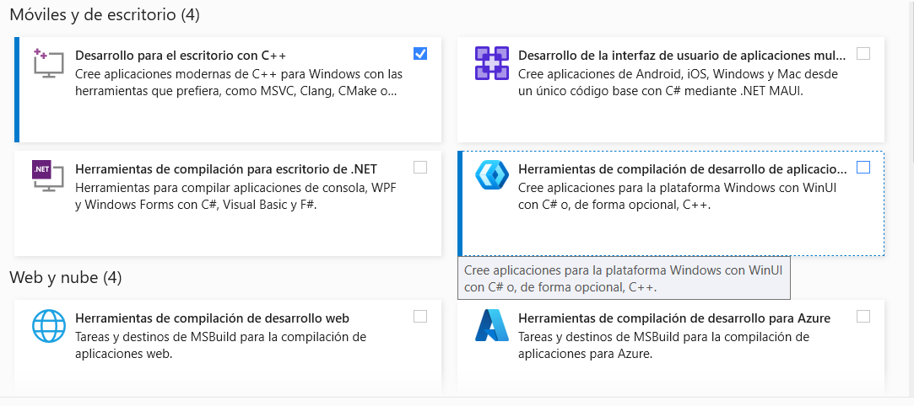
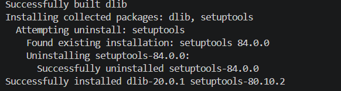
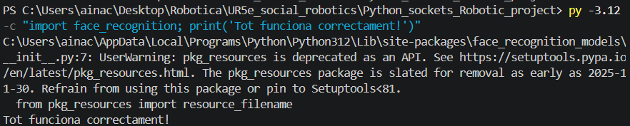

# Installing `dlib` on Windows and macOS (Python 3.11/3.12)

> **Operating-system note:** The first procedure below is for **Windows**. If you are using a **Mac**, follow the dedicated [macOS procedure](#macos-installation) instead. On Windows, activate the project's `.venv-win` environment and use `python` so that packages are installed into that environment. macOS normally uses `python3.12`.

This document describes how to install the `face_recognition` library and its main dependency, `dlib`, on Windows or macOS with Python 3.11 or 3.12. Because `dlib` contains C++ code, `pip` may need a native compiler and CMake when a compatible prebuilt wheel is not available.

## Windows installation

## Problem description

When installing the facial-recognition requirements with:

```powershell
python -m pip install -r requirements_face.txt
```

the process failed while compiling `dlib` and displayed errors similar to:

```text
ERROR: Failed building wheel for dlib
CMake Error: You must use Visual Studio to build a Python extension on Windows.
```

This happens because `dlib` was originally developed in C++. On a Windows system without a configured build environment, `pip` attempts to compile its source code locally but cannot find the required system tools, such as MSVC and CMake.

## Solution procedure

The following steps install the native C++ toolchain required to build the dependency.

### 1. Download the build tools

Download the official **Build Tools for Visual Studio** installer from Microsoft:

- [Visual Studio Build Tools - Microsoft](https://visualstudio.microsoft.com/visual-cpp-build-tools/)

### 2. Configure the C++ components

In the Visual Studio Installer, select the **Desktop development with C++** workload. This option includes the required components:

- MSVC Build Tools, the C++ compiler for x64/x86;
- Windows SDK;
- C++ CMake tools for Windows.



### 3. Restart the environment and install the packages

After the build tools have finished installing, restart Windows or VS Code and open a new PowerShell terminal. Activate the project environment and confirm that `python` belongs to `.venv-win`:

```powershell
cd UR5e_social_robotics\Python_sockets_Robotic_project
.\.venv-win\Scripts\Activate.ps1
python --version
python -c "import sys; print(sys.executable)"
```

The executable path must end in `.venv-win\Scripts\python.exe`. Then run the installation:

```powershell
python -m pip install -r requirements_face.txt
```

`pip` should now be able to compile and install the `dlib` source code successfully.



### 3.1 Work around `MSB6003` or missing `.tlog` directories

On some Windows systems, MSBuild finds the compiler and linker but fails while
using the deeply nested temporary directory created by `pip`. The relevant
error looks similar to:

```text
error MSB6003: The specified task executable "link.exe" could not be run.
System.IO.DirectoryNotFoundException: Could not find ...\cmTC_*.tlog
```

This is different from a missing compiler: the output already contains valid
paths to `cl.exe`, `link.exe`, and MSBuild. Use a short temporary directory for
the current PowerShell session and build `dlib` separately:

```powershell
New-Item -ItemType Directory -Force C:\t
$env:TEMP = "C:\t"
$env:TMP = "C:\t"
python -c "import tempfile; print(tempfile.gettempdir())"
python -m pip install --no-cache-dir dlib==20.0.1
python -m pip install -r requirements_face.txt
```

The temporary-directory check must print `C:\t`. The `TEMP` and `TMP`
assignments affect only the current PowerShell process; they do not permanently
change the Windows configuration. Do not apply this workaround on every
computer by default. Use it when the installation fails with the same
`MSB6003`/`.tlog` error.

### 4. Verify the installation

Run the following test in PowerShell to confirm that the module can be imported:

```powershell
python -c "import dlib, face_recognition; print('dlib', dlib.__version__, '- face_recognition is working correctly!')"
```

If the command prints the confirmation message without an exception, the installation is working correctly.



## macOS installation

On macOS, first try installing the requirements directly. A compatible package may install without any additional preparation:

```bash
cd UR5e_social_robotics/Python_sockets_Robotic_project
python3.12 -m pip install -r requirements_face.txt
```

If this command completes successfully, proceed directly to the [verification step](#4-verify-the-macos-installation). If it fails while building `dlib`, install the compiler and CMake as described below. The official `dlib` build instructions require both a working C++ compiler and CMake.

### 1. Install the Apple Command Line Tools

In Terminal, run:

```bash
xcode-select --install
```

Accept the installation in the macOS dialog. The Command Line Tools provide Apple Clang and the macOS SDK. If full Xcode is already installed and configured, this separate installation is normally unnecessary.

Confirm that the tools are available:

```bash
xcode-select -p
clang --version
```

The first command should print an active developer-tools path, and the second should identify Apple Clang.

### 2. Install or update the Python build tools and CMake

Run:

```bash
python3.12 -m pip install --upgrade pip wheel cmake
```

Confirm that CMake is available:

```bash
python3.12 -m cmake --version
```

### 3. Install the facial-recognition requirements

From the project directory, run the installation again:

```bash
cd UR5e_social_robotics/Python_sockets_Robotic_project
python3.12 -m pip install -r requirements_face.txt
```

Compiling `dlib` from source can take several minutes, particularly on a laptop. Do not interrupt the command while compilation is still progressing.

### 4. Verify the macOS installation

Run:

```bash
python3.12 -c "import dlib, face_recognition; print('dlib', dlib.__version__, '- face_recognition is working correctly!')"
```

If the command prints the `dlib` version and the confirmation message without an exception, the installation is working correctly.

### macOS troubleshooting

- If `python3.12` is not found, install Python 3.12 or use the exact Python executable associated with your virtual environment. Do not silently switch to a different Python version.
- If `xcode-select --install` reports that the tools are already installed, update them through **System Settings > General > Software Update**, then open a new Terminal window.
- If CMake is not found, use `python3.12 -m cmake --version` to verify the installation associated with the same Python interpreter.
- On Apple Silicon Macs, ensure that Python and the Terminal session use the same architecture. Mixing an Intel (`x86_64`) Python running through Rosetta with native Apple Silicon (`arm64`) build tools can cause compilation or linking errors.
- Read the complete build error before retrying. Repeatedly running `pip install` will not fix a missing compiler, SDK, or CMake installation.

## References

- [Apple: Installing the command-line tools](https://developer.apple.com/documentation/xcode/installing-the-command-line-tools)
- [dlib: How to compile](https://dlib.net/compile.html)
