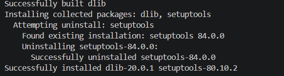

# Resolució de la instal·lació de `dlib` a Windows (Python 3.12)

Aquest document detalla el procediment seguit per resoldre els errors d'instal·lació de la llibreria `face_recognition` i la seva dependència principal `dlib` en un entorn Windows amb Python 3.12.

## Descripció del Problema
En executar la comanda d'instal·lació dels requisits de reconeixement facial (`py -3.12 -m pip install -r requirements_face.txt`), el procés fallava durant la fase de compilació de `dlib` mostrant l'error:

`ERROR: Failed building wheel for dlib`
`CMake Error: You must use Visual Studio to build a python extension on windows.`

Aquest error es produeix perquè `dlib` és una llibreria desenvolupada originalment en C++. En sistemes Windows sense un entorn de compilació prèviament configurat, `pip` intenta compilar el codi font localment però no troba les eines directives del sistema (`MSVC` i `CMake`).

## Procediment de Solució

Per resoldre aquesta dependència i permetre la compilació nativa de paquets C++, es van seguir els següents passos:

1. **Descarrega de les eines de compilació:**
   Es va descarregar l'instal·lador oficial de **Build Tools para Visual Studio** des del lloc web de Microsoft.
   - **Lloc web de descàrrega oficial:** [Visual Studio Build Tools - Microsoft](https://visualstudio.microsoft.com/visual-cpp-build-tools/)
   

2. **Configuració dels components de C++:**
    - **Paquet principal:** *Build Tools para Visual Studio* (dins la secció *Herramientas para Visual Studio*).
   Dins de l'instal·lador, es va seleccionar la càrrega de treball **"Desarrollo para el escritorio con C++"** (*Desktop development with C++*). Aquesta opció inclou automàticament els components necessaris:
   - **MSVC Build Tools** (compilador de C++ per a x64/x86)
   - **Windows SDK**
   - **C++ CMake tools for Windows**


3. **Reinici de l'entorn i instal·lació dels paquets:**
   Un cop completada la instal·lació de les eines de compilació, es va reiniciar VS Code i la terminal de PowerShell. En executar de nou la comanda d'instal·lació, `pip` va compilar correctament el codi font de `dlib`:
   ```powershell
   py -3.12 -m pip install -r requirements_face.txt



4. **Verificació**
    Per comprovar que el mòdul està totalment operatiu, es va executar el següent test a la terminal:
    ```powershell
    py -3.12 -c "import face_recognition; print('Tot funciona correctament!')"

